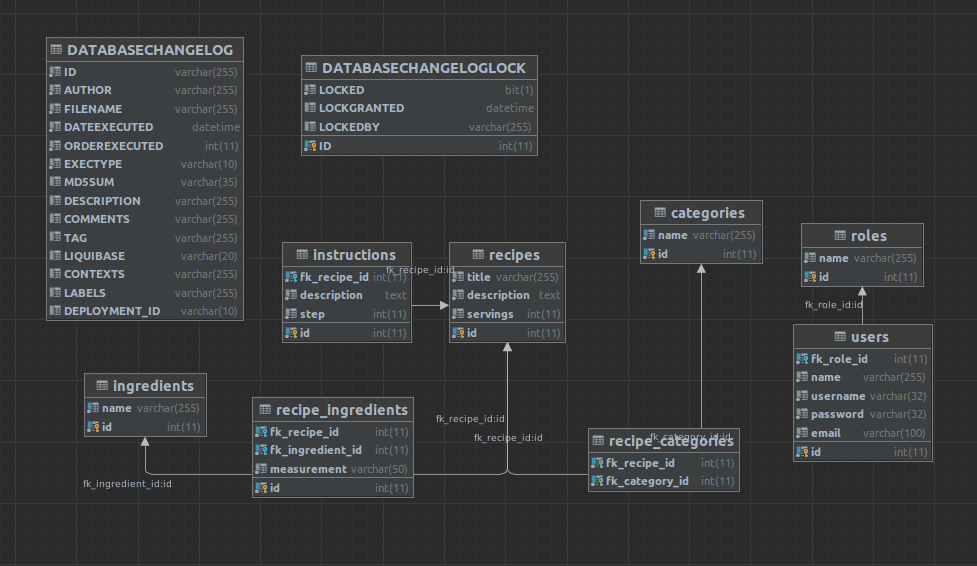

# Suppercook

Suppercook is a powerful RESTful web service that allows you to manage your recipes with ease. Built on Java 11 and Spring Boot 2.7, this app provides a robust and reliable platform for users to create, update, and remove recipes programmatically.

With Suppercook, you can leverage a rich set of RESTful endpoints to add, modify, and delete recipes in your own applications. The app also provides a comprehensive set of query parameters to enable powerful search and filtering capabilities, making it easy to find the recipe you need, no matter how complex your requirements are.

Suppercook's modular architecture and well-defined APIs make it easy to integrate with your existing technology stack. Whether you're building a mobile app, a web application, or an IoT device, Suppercook provides the flexibility and scalability you need to deliver high-quality culinary experiences to your users.

# Prerequisite

1. Java 11
2. Maven 3.8.6 or higher
3. (Optional) MySQL database is required to run production profile, but if you can you H2 database  
5. (Optional) Bash and Docker

# How to run the app?
There are 2 ways how to run this application. 
The first one works when you don't have docker and bash.
1. Clone the app on your local environment
2. Run `mvn clean install` (you can add -DskipTests to skip tests) and wait build to complete
3. And then `java -jar supercook-web-app-1.0-SNAPSHOT.jar`
4. It will run the backend app with H2 database. If you want to use `production` MySQL database then you need need to specify additional CLI arguments. For instance: `java -Dspring.profiles.active=production -Dspring.datasource.url=jdbc:mysql://localhost:3306/supercook -Dspring.datasource.username=<your-database-user> -Dspring.datasource.password=<your-database-password> -jar target/supercook-web-app-1.0-SNAPSHOT.jar`

Next option which is more prefered because it will run the backend service and MySQL databse for you.
1. Clone the app on your local environment
2. Run bash `build_docker_image.sh` script. It will build the application and then create Docker image with it.
3. Run `docker-compose up` and it will automatically start backend service and database.

Please note, it's possible to run database service independently: `docker-compose up -d database` (Can be useful when you want to run the backend service from IDE)

After that you can play with the application! Default application port is `8080`, so the API is reacheable on `http://localhost:8080`

# Rest API documentation
OpenAPI is used for Rest API documentation. You can see the documentation on the following url `http://localhost:8080/api-docs`

# Database design

Entity relationship diagram (ERD) for the application looks like:

Please note, Liquibase is used to manage database schema changes. Liquibase also inserts predefined data to a database.

# Features
1. Add, remove, update, search/filter recipes (see `/api/v1/recipes`, `/api/v1/recipes/{recipeId}/categories`, `/api/v1/recipes/{recipeId}/ingredients` and `/api/v1/recipes/{recipeId}/instructions` api endpoints)
2. Add, remove, update, search/filter category of recipes (see `/api/v1/categories` api endpoints)
3. Add, remove, update, search/filter ingredien of recipes (see `/api/v1/ingredients` api endpoints)
4. TODO: Add JWT token based security and ability to login/logout
